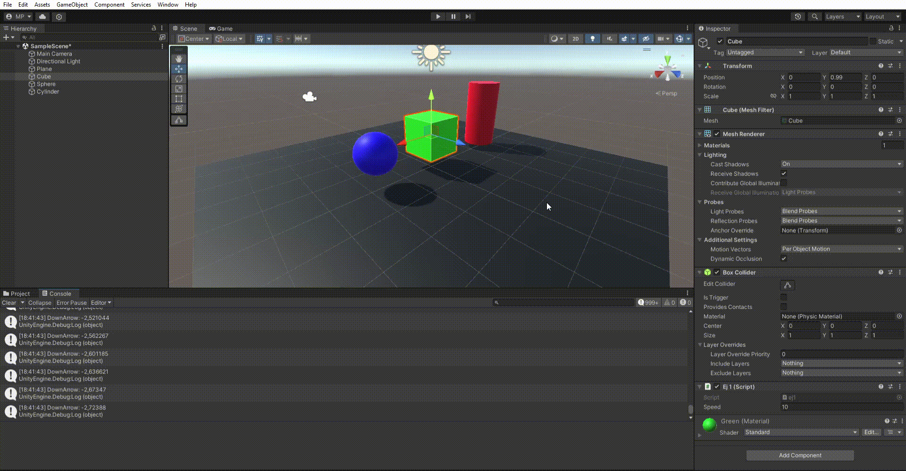
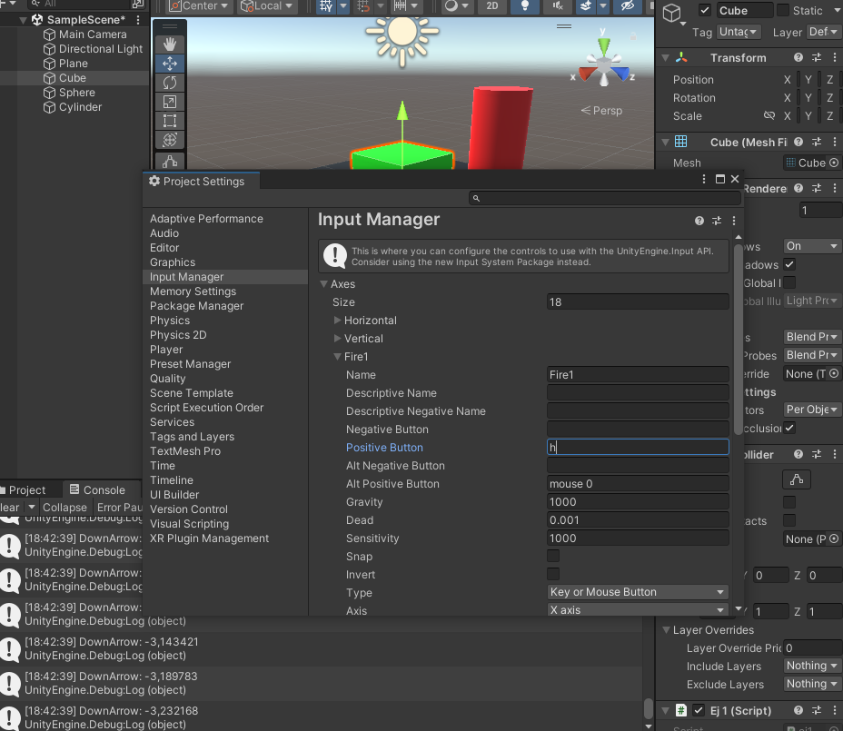
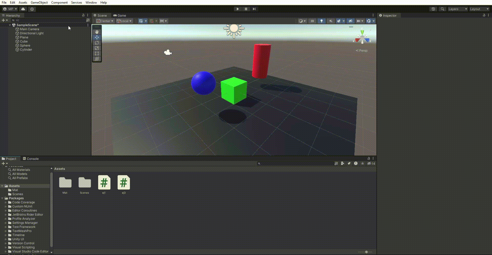
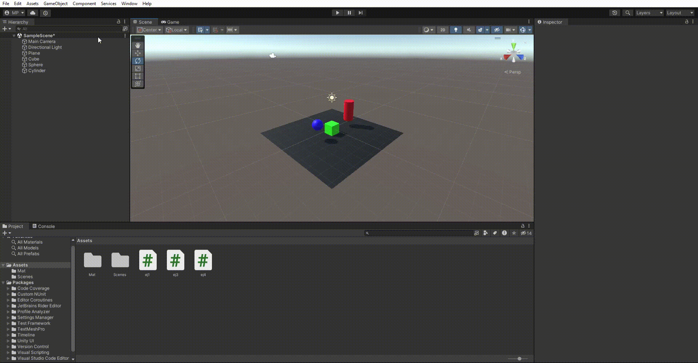
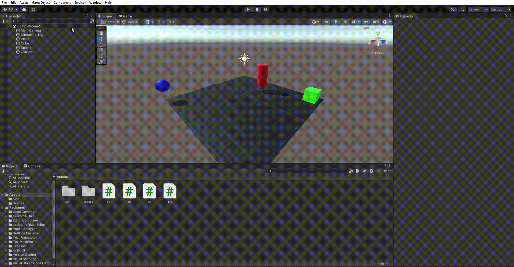
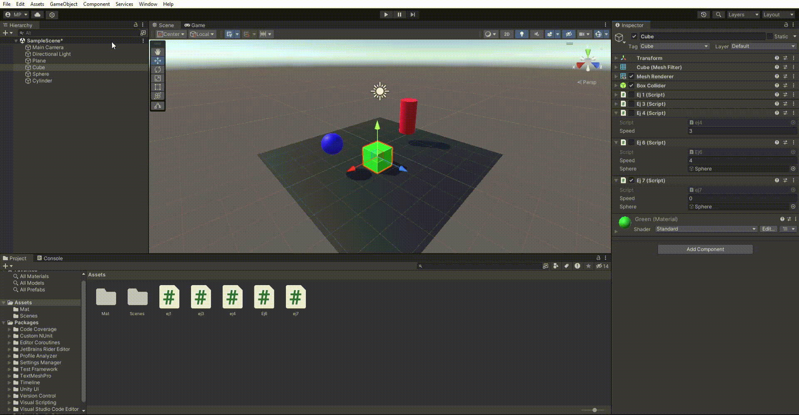
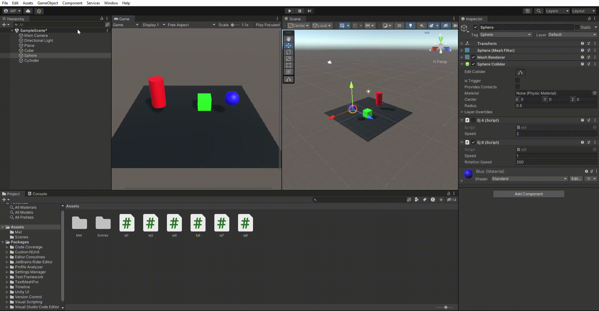
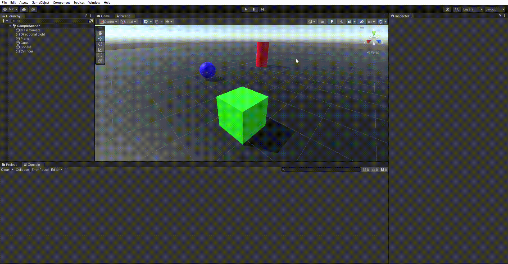
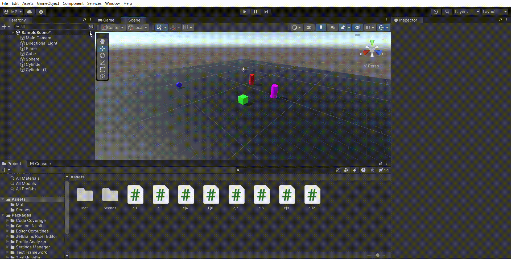

# Interfaces-Inteligentes-P02
Ejercicios de la práctica 2 de la asignatura de Interfaces Inteligentes

## Ejercicio 1
### Descripción
Agrega un campo velocidad al cubo de la práctica anterior y asígnale un valor que se pueda cambiar en el inspector de objetos. Muestra la consola el resultado de
multiplicar la velocidad por el valor del eje vertical y por el valor del eje horizontal cada vez que se pulsan las teclas flecha arriba-abajo ó flecha izquierda-derecha. El mensaje debe comenzar por el nombre de la flecha pulsada.

### Resultado

Enlace script: [Ejercicio 1](Scripts/ej1.cs)

## Ejercicio 2
### Descripción
Mapea la tecla H a la función disparo.

### Resultado

## Ejercicio 3
### Descripción
Crea un script asociado al cubo que en cada iteración traslade al cubo una cantidad
proporcional un vector que indica la dirección del movimiento: moveDirection que debe poder modificarse en el inspector. La velocidad a la que se produce el movimiento también se especifica en el inspector, con la propiedad speed.
- Duplicas las coordenadas de la dirección del movimiento.

    - El cubo viaja al doble de velocidad independientemente de la velocidad.

- Duplicas la velocidad manteniendo la dirección del movimiento.

    - El cubo viaja al doble de velocidad independientemente de las coordenadas de la dirección.

- La velocidad que usas es menor que 1

    - El cubo se mueve en la dirección contraria.

- La posición del cubo tiene y > 0

    - Solo cambia la posoción.

### Resultado

Enlace script: [Ejercicio 3](Scripts/ej3.cs)

## Ejercicio 4
### Descripción
Mueve el cubo con las teclas de flecha arriba-abajo, izquierda-derecha a la velocidad speed. Cada uno de estos ejes implican desplazamientos en el eje vertical y horizontal respectivamente. Mueve la esfera con las teclas w-s (movimiento vertical) a-d (movimiento horizontal).

### Resultado

Enlace script: [Ejercicio 4](Scripts/ej4.cs)

## Ejercicio 5
### Descripción
Adapta el movimiento en el ejercicio 4 para que sea proporcional al tiempo
transcurrido durante la generación del frame.
Ayuda:Utiliza el valor Time.DeltaTime para escalar la cantidad de espacio que recorre el objeto entre un frame y otro.

### Resultado

Enlace script: [Ejercicio 5](Scripts/ej4.cs)

## Ejercicio 6
### Descripción
Adapta el movimiento en el ejercicio 5 para que el cubo se mueva hacia la posición
de la esfera. Debes considerar, que el avance no debe estar influenciado por cuánto
de lejos o cerca estén los dos objetos.

### Resultado

Enlace script: [Ejercicio 6](Scripts/Ej6.cs)

## Ejercicio 7
### Descripción
Adapta el movimiento en el ejercicio 6 de forma que el cubo gire hacia la esfera.
Realiza pruebas cambiando la posición de la esfera mediante las teclas awsd.

### Resultado

Enlace script: [Ejercicio 7](Scripts/ej7.cs)

## Ejercicio 8
### Descripción
 Utilizar el eje “Horizontal” para girar el objetivo y que avance siempre en la dirección
hacia adelante.

### Resultado

Enlace script: [Ejercicio 8](Scripts/ej8.cs)

## Ejercicio 9
### Descripción
Configura el cilindro como un objeto físico, cuando el cubo o la esfera colisionen con él se debe mostrar un mensaje en consola con la etiqueta del objeto que haya
colisionado.

### Resultado

Enlace script: [Ejercicio 9](Scripts/ej9.cs)

## Ejercicio 10
### Descripción
Configura el cubo como un objeto cinemático y la esfera como un objeto físico.
Adapta los scripts del ejercicio 9 para obtener el mismo comportamiento.

### Resultado

Enlace script: [Ejercicio 10](Scripts/ej9.cs)

## Ejercicio 11
### Descripción
Configura el cilindro como un objeto de tipo Trigger. Adapta los scripts de los
ejercicios anteriores para obtener el mismo comportamiento.

### Resultado

Enlace script: [Ejercicio 11](Scripts/eje9.cs)

## Ejercicio 12
### Descripción
Agrega un cilindro de un color diferente al que ya hay en la escena y configúralo
como un objeto físico. Selecciona un conjunto de teclas que te permitan controlar su movimiento por la escena y prográmale un movimiento que permita dirigirlo hacia la
esfera.

### Resultado

Enlace script: [Ejercicio 8](Scripts/ej12.cs)